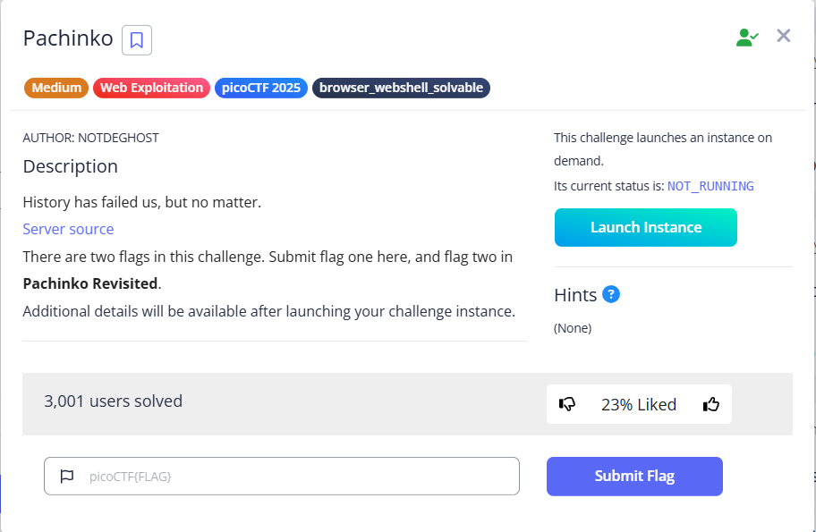
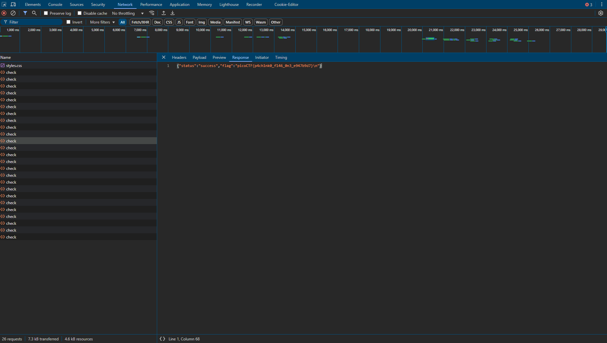

# Pachinko

tags: ` Web Exploitation`, `picoCTF 2025`, `browser_webshell_solvable`



### Source Code

```
function doRun(res, memory) {
  const flag = runCPU(memory);
  const result = memory[0x1000] | (memory[0x1001] << 8);
  if (memory.length < 0x1000) {
    return res.status(500).json({ error: 'Memory length is too short' });
  }

  let resp = "";

  if (flag) {
    resp += FLAG2 + "\n";
  } else {
    if (result === 0x1337) {
      resp += FLAG1 + "\n";
    } else if (result === 0x3333) {
      resp += "wrong answer :(\n";
    } else {
      resp += "unknown error code: " + result;
    }
  }

  res.status(200).json({ status: 'success', flag: resp });
}
```

可知不斷發送 `request`可讓 `resp`變為 `success`



最後即得到 `flag`
